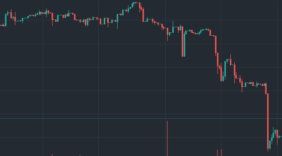

# Problem

There are two charts below from around the same timeframe 1 month May-June 2023.&#x20;

One of these charts belongs to a regenerative finance organization that has enabled communities to fund, build and protect community led products to protocols. Many of the most prominent web3 organizations were once it's grantees and it's distributed over USD$50 million in grant funding since 2019. These funds have been distributed to organizations developing open source coding to projects creating climate solutions.&#x20;

The other belongs to another meme coin which does not hold any fundamental and intrinsic value and has no utility. In fact, it is regarded as the most “memeable” meme coin built on the Ethereum blockchain and works as an ERC token. PEPE coin does not have a formal team or any roadmap.

<figure><figcaption>
Chart A
</figcaption></figure>

<figure><figcaption>
Chart B
</figcaption></figure>

Chart A belongs to Pepe (the meme coin), Chart B belongs to Gitcoin (the organization that has distributed millions in grant funding). Gitcoin arguably outweighs Pepe in terms of utility and tokenomics. However, it fails in terms of memetic value, social engagement and community support.&#x20;
